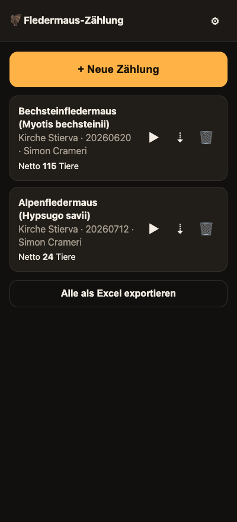
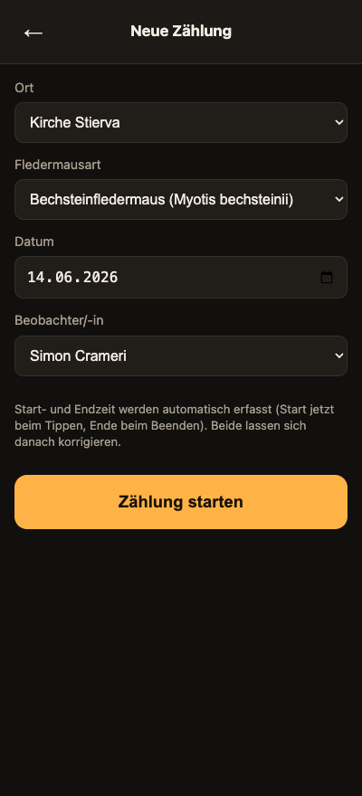
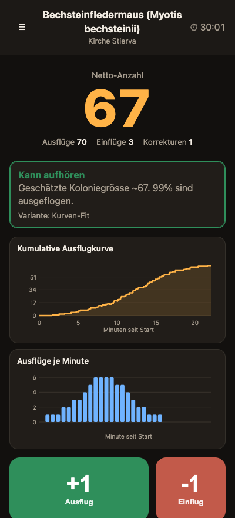
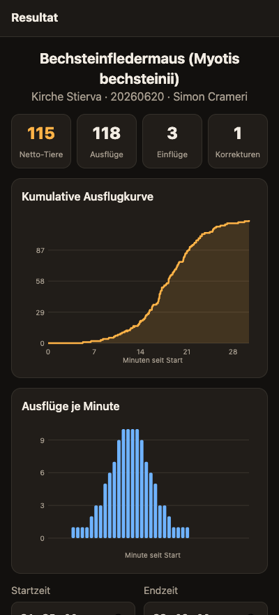
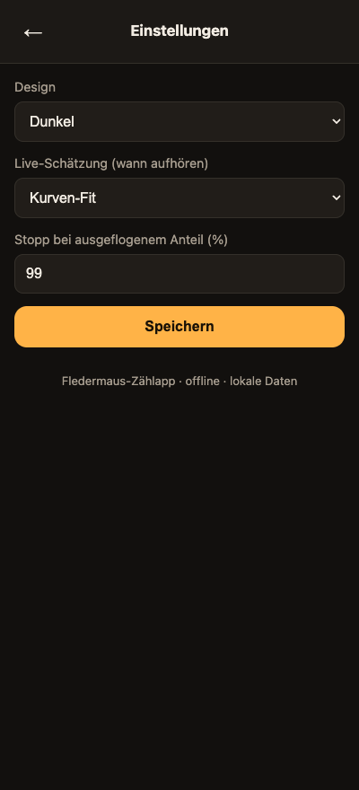

<div align="center">


# Fledermaus-Zählapp

Ausflugzählung von Fledermauskolonien im Feld - offline, auf dem Handy.

</div>

Beim Monitoring werden Kolonien dreimal pro Jahr (zweite Junihälfte, Juli, August)
gezählt: man sitzt abends vor dem Ausflugloch und zählt jedes ausfliegende Tier,
um die Koloniegrösse zu schätzen. Diese App unterstützt genau diese Aufnahme -
schnelles Zählen im Halbdunkel, sekundengenaue Protokollierung und ein
strukturierter Excel-Export als Grundlage für die nationale Datenbank.

Die App ist eine Progressive Web App: kein Server, kein App-Store, voll offline.
Alle Daten bleiben lokal auf dem Gerät.

## Screenshots

<table>
  <tr>
    <td align="center"><br/><sub>Übersicht</sub></td>
    <td align="center"><br/><sub>Neue Zählung</sub></td>
    <td align="center"><br/><sub>Zählen mit Live-Schätzung</sub></td>
  </tr>
  <tr>
    <td align="center"><br/><sub>Resultat</sub></td>
    <td align="center"><br/><sub>Einstellungen</sub></td>
    <td></td>
  </tr>
</table>

## Funktionen

- Erfassung pro Zählung: Ort, Fledermausart, Datum (YYYYMMDD) und
  Beobachter/-in aus Dropdowns; Start- und Endzeit werden automatisch erfasst
  und lassen sich nachträglich sekundengenau korrigieren.
- Zwei grosse Zählbuttons: +1 Ausflug und -1 Einflug. Der Einflug ist ein
  echtes biologisches Ereignis (ein Tier fliegt zurück) und wird bewusst von der
  Korrektur unterschieden.
- Korrektur einer Fehlzählung macht den letzten gültigen Klick rückgängig; er
  bleibt zur Nachvollziehbarkeit als ungültig im Export erhalten.
- Sekundengenaue Protokollierung jedes Ereignisses als Grundlage für die
  statistische Modellierung des Ausflugverhaltens.
- Live-Schätzung der Restbeobachtungszeit, drei umschaltbare Varianten.
- Grafische Auswertung: kumulative Ausflugkurve und Ausflüge je Minute, schon
  während des Zählens und im Resultat.
- Strukturierter Excel-Export.
- Drei Designs inklusive Nachtmodus (rot auf schwarz, schont die Nachtsicht).
- Crash-sicher: jeder Klick wird sofort lokal gespeichert, eine unterbrochene
  Zählung lässt sich fortsetzen.

## Bedienung

1. Neue Zählung: Ort, Art, Datum und Beobachter/-in wählen, dann
   "Zählung starten" (Startzeit wird erfasst).
2. Zählen:
   - +1 Ausflug: ein Tier fliegt aus.
   - -1 Einflug: ein Tier fliegt wieder ein (Doppelzählung vermeiden).
   - Korrektur (Fehlzählung): letzten Klick rückgängig machen.
   - Das Hinweisfeld zeigt, wann man aufhören kann.
3. Beenden: Endzeit wird erfasst, das Resultat mit den Kurven erscheint.
   Start- und Endzeit korrigierbar, Notiz möglich, dann Excel exportieren.

## Live-Schätzung der Restbeobachtungszeit

Ziel ist zu erkennen, wie lange nach dem voraussichtlich letzten Ausflug noch
zu beobachten ist, ohne welche zu verpassen und ohne unnötig lange zu warten.
Umschaltbar unter Einstellungen:

- Stille-Regel: Stopp-Empfehlung, wenn seit dem letzten Ausflug eine einstellbare
  Zahl Minuten ohne Ausflug vergangen ist.
- Raten-basiert: Stopp, wenn die Ausflugrate unter einen Anteil der bisherigen
  Spitzenrate fällt.
- Kurven-Fit: passt eine logistische Sättigungskurve an und schätzt die Restzeit
  bis zu einem eingestellten ausgeflogenen Anteil; nebenbei eine Schätzung der
  Koloniegrösse.

Die eigentliche, belastbare Modellierung erfolgt bewusst separat (zum Beispiel in
R) auf Basis des Ereignis-Exports. Die App liefert dafür die Rohdaten und im Feld
eine schnelle Orientierung.

## Excel-Export

Zwei Blätter:

- Zaehlungen: eine Zeile je Zählung mit Metadaten und Resultat (Ort, Art, Datum,
  Beobachter, Start- und Endzeit, Dauer, Ausflüge, Einflüge, Korrekturen,
  Netto-Koloniegrösse, verwendete Schätzvariante, Notiz).
- Ereignisse: eine Zeile je Klick mit sekundengenauem Zeitstempel, Sekunden seit
  Start, Typ (Ausflug/Einflug), Gültig-Flag und laufendem Saldo.

Das Übertragen in die nationale Datenbank ist bewusst ein separater, manueller
Schritt und nicht Teil der App.

## Installation auf dem Handy

Die App braucht für die Installation HTTPS. Details und drei Wege (GitHub Pages,
Netlify, lokal mit HTTPS) stehen in [DEPLOY.md](DEPLOY.md). Kurz:

1. Auf einer HTTPS-URL bereitstellen.
2. Die URL auf dem Handy öffnen.
3. "Zum Startbildschirm hinzufügen". Danach läuft die App offline wie eine native App.

## Lokal testen

```sh
python3 -m http.server 8000
```

Dann `http://localhost:8000` öffnen.

## Referenzlisten erweitern

Orte, Arten und Beobachter/-innen stehen in [js/data.js](js/data.js) und lassen
sich dort direkt ergänzen. Die Artenliste enthält die in der Schweiz vorkommenden
Fledermausarten im Format "Deutscher Name (wissenschaftlicher Name)".

## Technik

Reines HTML, CSS und JavaScript, ohne Build-Schritt:

- Service Worker für den Offline-Betrieb (`service-worker.js`)
- IndexedDB für die lokale Datenhaltung (`js/storage.js`)
- SheetJS für den Excel-Export (`lib/`, mitgeliefert)
- Diagramme als eigenes SVG, ohne externe Bibliothek (`js/charts.js`)

## Projektstruktur

```
index.html              App-Gerüst (alle Ansichten)
css/style.css           Themes (Dunkel, Nacht, Hell) und Layout
js/data.js              Referenzlisten (Orte, Arten, Beobachter)
js/storage.js           IndexedDB und Einstellungen
js/estimate.js          Zählreihen und die drei Schätzvarianten
js/charts.js            SVG-Diagramme
js/export.js            Excel-Export
js/app.js               Ablaufsteuerung und Ansichten
lib/xlsx.full.min.js    SheetJS (Excel)
icons/                  App-Icons und Manifest-Grafiken
docs/screenshots/       Screenshots für dieses README
.github/workflows/      GitHub-Pages-Deployment
```
